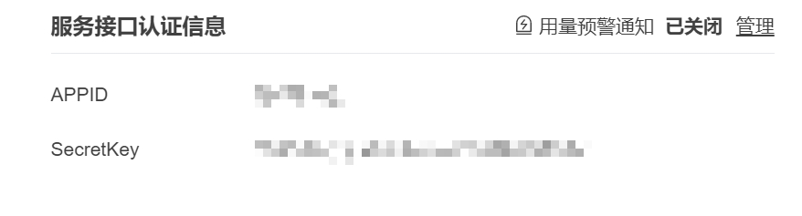

# 简体中文

## 这是什么

音源/视频提取文字，即 mp3/4 转 txt 的脚本，主要调用了讯飞`语音转写`的接口

## 如何使用

对于 mp4 文件，请直接修改文件的后缀名为 mp3 即可，相似格式依次类推。支持修改为 wav 格式，但是识别速度太慢，不建议

准备好 mp3 文件，并通过[讯飞开放平台](https://www.xfyun.cn)获取 APPID 和 SecretKey，并确认所需识别文件的相对位置，然后修改最后几行代码即可



```python
if __name__ == '__main__':
    api = RequestApi(
        appid="", secret_key="", upload_file_path=r"")
    api.all_api_request()
```

# English

## What is this

Audio/video extraction text, that is, the script of mp3/4 to txt, mainly calls the interface of iFLYTEK&#39;s `voice transcription`

## How to use

For mp4 files, please directly modify the suffix of the file to mp3, and so on for similar formats. Support modification to wav format, but the recognition speed is too slow, not recommended

Prepare the mp3 file, obtain APPID and SecretKey through [Xunfei Open Platform](https://www.xfyun.cn), confirm the relative location of the file to be identified, and then modify the last few lines of code


```python
if __name__ == '__main__':
    api = RequestApi(
        appid="", secret_key="", upload_file_path=r"")
    api.all_api_request()
```
